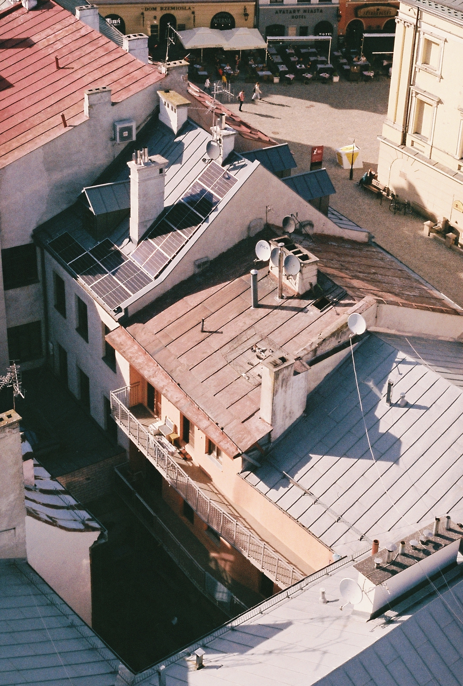

# This is a heading
## fajfhjkwe
kjfekj

### items

1. kfjekw
2. fajfa
3. arjerk



```cpp
#include <iostream>
using namespace std;

int main()
{
    int a = 5, b = 10, temp;

    cout << "Before swapping." << endl;
    cout << "a = " << a << ", b = " << b << endl;

    temp = a;
    a = b;
    b = temp;

    cout << "\nAfter swapping." << endl;
    cout << "a = " << a << ", b = " << b << endl;

    return 0;
}
```

## link

[link to another page](another.md)

## link to another page in folder

[link to another page in folder](set/test.md)
